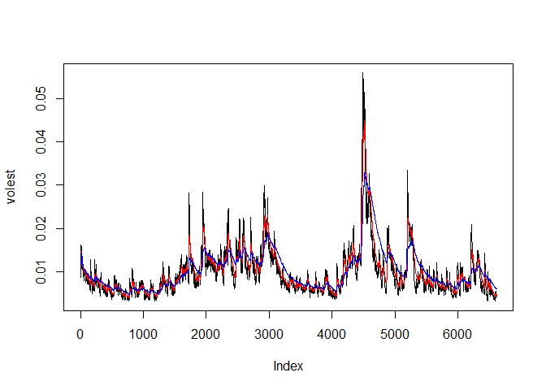

# SP500
Mustafa Sakarwala  
April 2, 2017  


## R Markdown

This is an R Markdown document for Assignment 11

The url to the github repository is

https://github.com/mustafaabbas77/MSDS6306_Assignment11.git


```r
## Uncomment and install packages if you don't have it
#install.packages("tseries")

library(tseries)

## S&P 500 (^GSPC)
###    SNP - SNP Real Time Price. Currency in USD

# TODO: Download the data of SP500 '^gspc'.
SNPdata <- get.hist.quote('^gspc' ,quote="Close")
```

```
## time series ends   2017-03-31
```

```r
# TODO: Calculate the log returns, which is the subtractration of log(lag(SNPdata)) and log(SNPdata)
SNPret <- diff(log(SNPdata), lag=1)

# TODO: Calculate volatility measure that is to multiply sd(SNPret),sqrt(250), 100
SNPvol <- sd(SNPret) * sqrt(250)* 100


## Define getVol function for volatility
getVol <- function(d, logrets) {
	var = 0
	lam = 0
	varlist <- c()

	for (r in logrets) {
		lam = lam*(1 - 1/d) + 1
	  var = (1 - 1/lam)*var + (1/lam)*r^2
		varlist <- c(varlist, var)
	}

	sqrt(varlist)
}


# Calculate volatility over entire length of series for various three different decay factors: 10 30. 100

# TODO: call getVol function with the parameters: 10,SNPret
volest <- getVol(10,SNPret)

# TODO: call getVol function with the parameters: 30,SNPret
volest2 <- getVol(30,SNPret)

# TODO: call getVol function with the parameters: 100,SNPret
volest3 <- getVol(100,SNPret)

# Plot the results, overlaying the volatility curves on the data, just as was done in the S&P example.
plot(volest,type="l")

# TODO: Add connected line segments for volest2 with the parameters: type="l",col="red"
# hint: look at oilExerciseCode.R file at the live discussion
lines(volest2,type="l",col="red")

# TODO: Add connected line segments for volest3 with the parameters: type="l",col="blue"
lines(volest3, type = "l", col="blue")
```

<!-- -->
